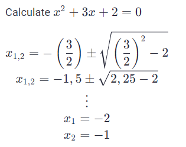

# LaTeX

Repeatio uses LaTeX (KaTeX) to render mathematical functions.

<!-- Wikipedia like table -->
<!-- Weird combination of spans because github adds weird padding to list elements -->
<table>
  <tr>
   <th>Table of Content</th>
  </tr>
   <tr>
    <td>
      <b>
      <span>1. <a href="#1-general">General</a></span> </br >
      <span>1.1 <a href="#11-inline-functions">Inline Functions</a></span> </br >
      <span>1.2 <a href="#12-multiline-functions">Multiline Functions</a></span> </br >
      <span>2. <a href="#2-fractions-and-binomials">Fractions and Binomials</a></span> </br >
      <span>3. <a href="#3-power-and-indices">Power and Indices</a></span> </br >
      <span>4. <a href="#4-roots">Roots</a></span> </br >
      <span>5. <a href="#5-operators">Operators</a></span> </br >
      <span>6. <a href="#6-sums-and-integrals">Sums and Integrals</a></span> </br >
      <span>7. <a href="#7-brackets">Brackets</a></span> </br >
      <span>8. <a href="#8-accents">Accents</a></span> </br >
      <span>9. <a href="#9-arrows">Arrows</a></span> </br >
      <span>10. <a href="#10-greek-letters">Greek letters</a></span> </br >
      <span>11. <a href="#11-environments">Environments</a></span> </br >
      <span>12. <a href="#12-misc">Misc</a></span> </br >
      <span>13. <a href="#13-sources-and-more-types">Sources and more Types</a></span> </br >
      </b>
    </td>
   </tr>
</table>

## 1. General

Although not required it is generally advised to add a empty line after each LaTeX function.

### 1.1 Inline Functions

LaTeX inline functions are written between single dollar signs `$...$`.  
**_Example:_**

<!--Using html here because markdown tables don't support multiline table definitions but only markdown allows code highlight and code copy-->
<table>
  <tr>
    <th>Input</th>
    <th>Result</th>
  </tr>
  <tr>
    <td>

```latex
Calculate $x$:

$x =\frac{\sqrt{20}}{3\times(5-10)^2}$

Round to 2 decimal places.
```  

  </td>
    <td>

Calculate $x$:

$x =\frac{\sqrt{20}}{3\times(5-10)^2}$

Round to 2 decimal places.

   </td>
  </tr>
</table>

### 1.2 Multiline Functions

LaTeX multiline functions are written between double dollar signs `$$...$$`.  
For a new line in the function use two backslashes `\\`.  
To align a function use `\begin{align}` in combination with `&=` and `\end{align}`.

<table>
  <thead>
    <tr>
      <th>Type</th>
      <th>Input</th>
      <th>Result</th>
    </tr>
  </thead>
  <tbody>
  <tr>
    <td>Unaligned</td>
    <td>

```latex
Calculate $x^2+3x+2 = 0$

$$
x_{1,2} = -\left(\frac{3}{2}\right) \pm \sqrt{ \left(\frac{3}{2}\right)^{2}-2} \\
x_{1,2} = -1,5 \pm \sqrt{2,25 - 2} \\
\vdots  \\
x_1 = -2 \\
x_2 = -1
$$

```

  </td>
    <td>

  

  </td>
  </tr>
    <tr>
      <td>Aligned</td>
      <td>

```latex
Calculate $x^2+3x+2 = 0$

$$
\begin{align}
x_{1,2} &= -\left(\frac{3}{2}\right) \pm \sqrt{ \left(\frac{3}{2}\right)^{2}-2} \\
x_{1,2} &= -1,5 \pm \sqrt{2,25 - 2} \\
\vdots \nonumber \\
x_1 &= -2 \\
x_2 &= -1 \nonumber
\end{align}
$$
```

  </td>
      <td>

Calculate $x^2+3x+2 = 0$

$$
\begin{align}
x_{1,2} &= -\left(\frac{3}{2}\right) \pm \sqrt{ \left(\frac{3}{2}\right)^{2}-2} \\
x_{1,2} &= -1,5 \pm \sqrt{2,25 - 2} \\
\vdots \nonumber \\
x_1 &= -2 \\
x_2 &= -1 \nonumber
\end{align}
$$

> **Note**  
> If the numbers next to the function overlap with the content of the function add `\nonumber` to the line.

  </td>
    </tr>
  </tbody>
</table>

## 2. Fractions and Binomials

| Type                  | Input                             | Result                           |
|:--------------------- | :-------------------------------- |:---------------------------------|
| Fraction              | ```$\frac{n}{k}$```               |     $\frac{n}{k}$                |
| Fraction (advanced)   | ```$\frac{n!}{k!(n-k)!}$```       |     $\frac{n!}{k!(n-k)!}$        |
| Binomial coefficient  | ```$\binom{n}{k}$```              |     $\binom{n}{k}$               |
| Fraction in Fraction  | ```$\frac{\frac{x}{1}}{x - y}$``` |     $\frac{\frac{x}{1}}{x - y}$  |
| Fraction              | ```$^x/_y$```                     |     $^x/_y$                      |

## 3. Power and Indices

| Type                      | Input                        | Result                 |
| :------------------------ | :--------------------------- |:---------------------- |
| Superscript               | ```$n^2$```                  |     $n^2$              |
| Superscript (advanced)    | ```$n^{2+k}$```              |     $n^{2+k}$          |
| Subscript                 | ```$k_n$```                  |     $k_n$              |
| Subscript (advanced)      | ```$k_{n+1}$```              |     $k_{n+1}$          |
| Sup-/Subscript            | ```$k_n^2$```                |     $k_n^2$            |

## 4. Roots

| Type                      | Input                        | Result                     |
| :------------------------ | :--------------------------- |:---------------------------|
| Square root               | ```$\sqrt{k}$```             |    $\sqrt{k}$              |
| Square root with exponent | ```$\sqrt[n]{k}$```          |    $\sqrt[n]{k}$           |

## 5. Operators

| Type                  | Input                        | Result                     |
| :-------------------- | :--------------------------- |:---------------------------|
| Plus                  | ```$+$```                    |     $+$                    |
| Minus                 | ```$-$```                    |     $-$                    |
| Multiplied by         | ```$\times$```               |     $\times$               |
| Divided by            | ```$\div$```                 |     $\div$                 |
| Comma                 | ```$,$```                    |     $,$                    |
| Colon                 | ```$:$```                    |     $:$                    |
| Semicolon             | ```$;$```                    |     $;$                    |
| Exclamation           | ```$!$```                    |     $!$                    |
| Horizontal dots       | ```$\dots$```                |     $\dots$                |
| Vertical dots         | ```$\vdots$```               |     $\vdots$               |
| Diagonal dots         | ```$\ddots$```               |     $\ddots$               |
| Sinus                 | ```$\sin$```                 |     $\sin$                 |
| Cosine                | ```$\cos$```                 |     $\cos$                 |
| Tangent               | ```$\tan$```                 |     $\tan$                 |
| Limit                 | ```$\lim$```                 |     $\lim$                 |
| Exponential function  | ```$\exp$```                 |     $\exp$                 |
| Mod                   | ```$\bmod$```                |     $\bmod$                |
| Infinity              | ```$\infty$```               |     $\infty$               |
| Equivalent            | ```$\equiv$```               |     $\equiv$               |
| Not equal             | ```$\ne$```                  |     $\ne$                  |
| Approximately         | ```$\approx$```              |     $\approx$              |
| Less than             | ```$\leq$```                 |     $<$                    |
| Less or equal than    | ```$\leq$```                 |     $\leq$                 |
| Greater than          | ```$\geq$```                 |     $>$                    |
| Greater or equal than | ```$\geq$```                 |     $\geq$                 |
| Not                   | ```$\neg$```                 |     $\neg$                 |

## 6. Sums and Integrals

| Type                 | Input                                             | Result                                         |
| :------------------- | :------------------------------------------------ |:-----------------------------------------------|
| Summation            | ```$\sum$```                                      |    $\sum$                                      |
| Summation (advanced) | ```$\sum\limits_{i=0}^n f(x)$```                  |    $\sum\limits_{i=0}^n f(x)$                  |
| Integral             | ```$int$```                                       |    $\int$                                      |
| Integral (advanced)  | ```$\int_0^\infty \mathrm{e}^{-x},\mathrm{d}x$``` |    $\int_0^\infty \mathrm{e}^{-x},\mathrm{d}x$ |
| Integral (limit)     | ```$\int\limits_a^b$```                           |    $\int\limits_a^b$                           |
| Integral (double)    | ```$\iint$```                                     |    $\iint$                                     |
| Integral (triple)    | ```$\iiint$```                                    |    $\iiint$                                    |
| Product              | ```$\prod$```                                     |    $\prod$                                     |
| Coproduct            | ```$\coprod$```                                   |    $\coprod$                                   |
| Bigoplus             | ```$\bigoplus$```                                 |    $\bigoplus$                                 |
| BigoTimes            | ```$\bigotimes$```                                |    $\bigotimes$                                |
| Bigodot              | ```$\bigodot$```                                  |    $\bigodot$                                  |
| Plus-Minus           | ```$\pm$```                                       |    $\pm$                                       |

## 7. Brackets

| Type                 | Input                            | Result                        |
| :------------------- | :------------------------------- | :---------------------------- |
| Parenthesis          | ```$(a)$```                      |  $(a)$                        |
| parenthesis (bigger) | ```$left(\frac{a^2}{2}\right)``` |  $\left(\frac{a^2}{2}\right)$ |
| Bracket              | ```$[a]$```                      |  $[a]$                        |
| Brace                | ```$\{a\}$```                    |  {a}                          |
| Angle bracket        | ```$\langle f \rangle$```        |  $\langle f \rangle$          |
| Floor                | ```$\lfloor f \rfloor$```        |  $\lfloor f \rfloor$          |
| Ceiling              | ```$\lceil f \rceil$```          |  $\lceil f \rceil$            |

## 8. Accents

| Input                       | Result                     |
| :-------------------------- |:---------------------------|
| ```$a^{\prime}$```          |    $a^{\prime}$            |
| ```$a’$```                  |    $a’$                    |
| ```$a’’$```                 |    $a’’$                   |
| ```$a’’’$```                |    $a’’’$                  |
| ```$\hat{a}$```             |    $\hat{a}$               |
| ```$\bar{a}$```             |    $\bar{a}$               |
| ```$\grave{a}$```           |    $\grave{a}$             |
| ```$\acute{a}$```           |    $\acute{a}$             |
| ```$\dot{a}$```             |    $\dot{a}$               |
| ```$\ddot{a}$```            |    $\ddot{a}$              |
| ```$\not{a}$```             |    $\not{a}$               |
| ```$\mathring{a}$```        |    $\mathring{a}$          |
| ```$\check{a}$```           |    $\check{a}$             |
| ```$\vec{a}$```             |    $\vec{a}$               |
| ```$\overrightarrow{AB}$``` |    $\overrightarrow{AB}$   |
| ```$\overleftarrow{AB}$```  |    $\overleftarrow{AB}$    |
| ```$\vec{F}$```             |    $\vec{F}$               |
| ```$\overline{aaa}$```      |    $\overline{aaa}$        |
| ```$\underline{a}$```       |    $\underline{a}$         |

## 9. Arrows

| Input                       | Result                     |
| :-------------------------- |:---------------------------|
| ```$\to$```                 |     $\to$                  |
| ```$\uparrow$```            |     $\uparrow$             |
| ```$\downarrow$```          |     $\downarrow$           |
| ```$\updownarrow$```        |     $\updownarrow$         |
| ```$\Uparrow$```            |     $\Uparrow$             |
| ```$\Downarrow$```          |     $\Downarrow$           |

## 10. Greek letters

| Input                       | Result                     |
| :-------------------------- |:---------------------------|
| ```$\alpha$```              |     $\alpha$               |
| ```$A$```                   |     $A$                    |
| ```$\beta$```               |     $\beta$                |
| ```$B$```                   |     $B$                    |
| ```$\gamma$```              |     $\gamma$               |
| ```$\Gamma$```              |     $\Gamma$               |
| ```$\delta$```              |     $\delta$               |
| ```$\Delta$```              |     $\Delta$               |
| ```$\epsilon$```            |     $\epsilon$             |
| ```$\Epsilon$```            |     $E$                    |
| ```$\zeta$```               |     $\zeta$                |
| ```$\Zeta$```               |     $Z$                    |
| ```$\eta$```                |     $\eta$                 |
| ```$\Eta$```                |     $H$                    |
| ```$\theta$```              |     $\theta$               |
| ```$\Theta$```              |     $\Theta$               |
| ```$\kappa$```              |     $\kappa$               |
| ```$\Kappa$```              |     $K$                    |
| ```$\lambda$```             |     $\lambda$              |
| ```$\Lambda$```             |     $\Lambda$              |
| ```$\mu$```                 |     $\mu$                  |
| ```$\Mu$```                 |     $M$                    |
| ```$\nu$```                 |     $\nu$                  |
| ```$\Nu$```                 |     $N$                    |
| ```$\xi$```                 |     $\xi$                  |
| ```$\Xi$```                 |     $\Xi$                  |
| ```$\pi$```                 |     $\pi$                  |
| ```$\Pi$```                 |     $\Pi$                  |
| ```$\rho$```                |     $\rho$                 |
| ```$\Rho$```                |     $P$                    |
| ```$\sigma$```              |     $\sigma$               |
| ```$\Sigma$```              |     $\Sigma$               |
| ```$\tau$```                |     $\tau$                 |
| ```$\au$```                 |     $T$                    |
| ```$\phi$```                |     $\phi$                 |
| ```$\Phi$```                |     $\Phi$                 |
| ```$\chi$```                |     $\chi$                 |
| ```$\Chi$```                |     $X$                    |
| ```$\psi$```                |     $\psi$                 |
| ```$\Psi$```                |     $\Psi$                 |
| ```$\omega$```              |     $\omega$               |
| ```$\Omega$```              |     $\Omega$               |
| ```$\varphi$```             |    $\varphi$               |

## 11. Environments

<table>
  <tr>
   <th>Type</th>
   <th>Input</th>
   <th>Result</th>
  </tr>
  <tr>
    <td>
      Matrix
  </td>
<td>

```latex
$$
\begin{matrix}
a & b \\
c & d
\end{matrix}
$$
```

  </td>
  <td>

$$
\begin{matrix}
   a & b \\
   c & d
\end{matrix}
$$
</td>
  </tr>
  <!-- Parentheses -->
   <tr>
    <td>
      Matrix (Parentheses)
  </td>
<td>

```latex
$$
\begin{pmatrix}
a & b \\
c & d
\end{pmatrix}
$$
```

  </td>

  <td>

$$
\begin{pmatrix}
   a & b \\
   c & d
\end{pmatrix}
$$

</td>
</tr>
  <!-- Vertical -->
   <tr>
    <td>
      Matrix (Vertical)
  </td>
<td>

```latex
$$
\begin{vmatrix}
a & b \\
c & d
\end{vmatrix}
$$
```

  </td>
  <td>

$$
\begin{vmatrix}
   a & b \\
   c & d
\end{vmatrix}
$$

</td>
</tr>
  <!-- Double Vertical -->
   <tr>
    <td>
      Matrix (double Vertical)
  </td>
<td>

```latex
$$
\begin{Vmatrix}
a & b \\
c & d
\end{Vmatrix}
$$
```

  </td>

  <td>

$$
\begin{Vmatrix}
   a & b \\
   c & d
\end{Vmatrix}
$$

</td>
</tr>
  <!-- Curly Brackets -->
   <tr>
    <td>
      Matrix (curly brackets)
  </td>
<td>

```latex
$$
\begin{Bmatrix}
a & b \\
c & d
\end{Bmatrix}
$$
```

  </td>

  <td>

$$
\begin{Bmatrix}
   a & b \\
   c & d
\end{Bmatrix}
$$

</td>
</tr>
  <!-- Advanced Equation -->
   <tr>
    <td>
      Advanced Matrix Equation
  </td>
<td>

```latex
$$
\begin{equation*}
A_{m,n} =
\begin{pmatrix}
a_{1,1} & a_{1,2} & \cdots & a_{1,n} \\
a_{2,1} & a_{2,2} & \cdots & a_{2,n} \\
\vdots  & \vdots  & \ddots & \vdots  \\
a_{m,1} & a_{m,2} & \cdots & a_{m,n}
\end{pmatrix}
\end{equation*}
$$
```

  </td>

  <td>

$$
\begin{equation*}
A_{m,n} =
\begin{pmatrix}
a_{1,1} & a_{1,2} & \cdots & a_{1,n} \\
a_{2,1} & a_{2,2} & \cdots & a_{2,n} \\
\vdots  & \vdots  & \ddots & \vdots  \\
a_{m,1} & a_{m,2} & \cdots & a_{m,n}
\end{pmatrix}
\end{equation*}
$$

</td>
</tr>
</table>

**[More Matrix Examples](<https://www.math-linux.com/latex-26/faq/latex-faq/article/how-to-write-matrices-in-latex-matrix-pmatrix-bmatrix-vmatrix-vmatrix>)**

## 12. Misc

| Input                       | Result                     |
| :-------------------------- |:---------------------------|
| ```$\backslash$```          |     $\backslash$           |
| ```$\nonumber$```           |     $\nonumber$            |
| ```$\color{grey}x$```       |     $\color{grey}x$        |

## 13. Sources and more Types

- <https://oeis.org/wiki/List_of_LaTeX_mathematical_symbols>
- <https://csrgxtu.github.io/2015/03/20/Writing-Mathematic-Fomulars-in-Markdown/>
- <https://katex.org/docs/supported.html>
- <https://wch.github.io/latexsheet/>
