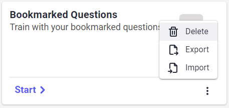

<div align="center">
  <!-- Icon -->
  <a href="https://www.repeatio.de">
    
  </a>
  
  <!-- Text -->
  <h1 align="center">
   repeatio.de <br/>
    <a href="https://www.repeatio.de">Start Learning Today</a>
  </h1>
  
  <!-- Mockup -->
  <a href="https://www.repeatio.de">
    
  </a>
</div>

## :construction: Current limitations (v0.5)

> **Warning**  
> **Regularly** backup your data by **exporting** your modules and bookmarked questions!
> **Clearing the browser cache** (e.g. before an exam) will result in the **loss of your data**!
> Currently not all UI elements are working (e.g. module progress)!  

## Browser Support

### Desktop

|               |      Chrome       |       Edge        |     Safari      |      Firefox      |       Opera       | Internet Explorer | Electron (Developers only) |
| :-----------: | :---------------: | :---------------: | :-------------: | :---------------: | :---------------: | :---------------: | :------------------------: |
|  Performance  | :1st_place_medal: | :1st_place_medal: | :grey_question: | :1st_place_medal: | :3rd_place_medal: |        :x:        |     :1st_place_medal:      |
| Functionality | :1st_place_medal: |  :grey_question:  | :grey_question: | :2nd_place_medal: | :1st_place_medal: |        :x:        |     :3rd_place_medal:      |

<!--Firefox not perfect because: window.showSaveFilePicker is not supported + :has() not supported-->
<!--Opera ok because modal performance-->

### Mobile

|               |      Chrome       |      Edge       |      Safari       |      Firefox      |      Opera      | Samsung Internet |
| :-----------: | :---------------: | :-------------: | :---------------: | :---------------: | :-------------: | :--------------: |
|  Performance  | :2nd_place_medal: | :grey_question: | :3rd_place_medal: | :3rd_place_medal: | :grey_question: |       :x:        |
| Functionality | :1st_place_medal: | :grey_question: | :3rd_place_medal: | :1st_place_medal: | :grey_question: |       :x:        |

<!--Firefox not perfect because html validation is not supported, :has() not supported-->

### Legend

|       Emoji       | Value       |
| :---------------: | ----------- |
| :1st_place_medal: | Excellent   |
| :2nd_place_medal: | Very good   |
| :3rd_place_medal: | Ok          |
|  :grey_question:  | Unknown     |
|        :x:        | Unsupported |

## Module

### Create a new Module

1. Click on `Add Module` in the `Module Overview`
2. Fill in the fields under `Create new Module`
    - `ID`: The ID of the module has to be unique!
    - `Name`: The full name of the new module.
    - `Language`: The language is used for spellchecking when creating a question.
    - `Compatibility Version`: This value describes when the module was created. The user can't change this value.
3. Click on `Create`
4. The new module will appear in the `Module Overview` and can be viewed by clicking on `View >`

### Import an existing Module

1. Click on `Add Module` in the `Module Overview`
2. Either click on `Browse files` and select the file(s) `your-file.json` or `drag and drop` the file(s) into the dotted area
3. Finally click on `Add`
4. The new module will appear in the `Module Overview` and can be viewed by clicking on `View >`

> **Warning**  
> If the module already exist in your modules it will be completely overwritten with the imported module!

### Export a Module

1. In the `Module Overview` click on the 3 dots (`⋮`) in the module you want to export
2. Click on `Export`
3. Depending on the browser you will either be prompted to choose a file location or the module will be downloaded directly to the default download location

### Delete a Module

1. In the `Module Overview` click on the 3 dots (`⋮`) in the module you want to delete
2. Click on `Delete`

## Practice Modes

You can practice your questions in chronological (default) or random order.  
There is also the option to just train with bookmarked questions.

### Chronological

The questions are in order that they were created in.


### Random

The order of the questions is random but each question will only be shown once.


### Bookmarked

To practice with the questions you bookmarked navigate to the module and click the `Start >` button inside `Bookmarked Questions`.  
The questions are in the order that they were saved in. **[Read](#bookmarked-questions)** how to bookmark a question.


## Adding and editing Questions

### Add a new Question

1. Inside the module you want to add a question find the card `Add Question` and click on `Add >`.
2. Fill in the required fields ([Learn more](#question-editor) about the Question Editor)
3. Click on `Add` or `Add + View`
4. The question will be added to the end of the existing questions

### Edit a existing Question

1. Click on the edit button inside a question  
  
2. Fill in the required fields ([Learn more](#question-editor) about the Question Editor)
3. Click on `Update`

> **Note**  
> On mobile you may have to first extend the bottom of the navigation

### Question Editor

#### Fields

| Field           | Description                          |     Styleable?     |     Required?      |
| :-------------- | :----------------------------------- | :----------------: | :----------------: |
| `id`            | The unique id of the questions       |        :x:         | :heavy_check_mark: |
| `title`         | The title of the question            | :heavy_check_mark: |        :x:         |
| `points`        | Max point value of a question        |        :x:         |        :x:         |
| `type`          | The type of the question             |        :x:         | :heavy_check_mark: |
| `help`          | Explain what the user needs to do    | :heavy_check_mark: |        :x:         |
| `answerOptions` | The interactive part of the question | :heavy_check_mark: | :heavy_check_mark: |

#### Question Types

<details>
  <summary><b>Multiple-Choice</b></summary>

  <p>Multiple-Choice questions have <b>exactly one</b> correct answer and are characterized by a circle in front of each option.<p>

  <i><b>Example:</b></i>

  

  <p>You can add and edit this type of question through the normal UI.</p>

</details>

<details>
  <summary><b>Multiple-Response</b></summary>

  <p>Multiple-Response questions can have <b>multiple</b> correct answers and are characterized by a square in front of each option.<p>

  <i><b>Example:</b></i>

  

  <p>You can add and edit this type of question through the normal UI.</p>

</details>

<details>
  <summary><b>Gap Text</b></summary>

  <p>Gap Text questions require the user to fill in the missing words. In the editor a gap is created by wrapping the correct word(s) inside square brackets and separating multiple correct words with a semicolon like this: [correct; right].<p>

  <i><b>Example:</b></i>

  

  <p>You can add and edit this type of question through the normal UI.</p>
</details>

<details>
  <summary><b>Gap Text Dropdown</b></summary>

  <p>The question type Gap Text Dropdown requires the user to select the correct answer for a gap from a dropdown list. A gap is created by a square bracket.<p>

  <i><b>Example:</b></i>

  

  <p>You can <b>not</b> add this type of question through the normal UI. Download the module and edit the raw .json file!</p>
  <b><i>.json:</i></b>

  ```json
  {
    "id": "qID-4",
    "title": "This is a question of the type gap text with preselected values for each gap. Each gap is rated independently, meaning that part points are possible. Choose the correct values for each gap in the following text.",
    "points": 5,
    "type": "gap-text-dropdown",
    "help": "Fill in the blanks with the **correct** Values!",
    "answerOptions": {
      "text": "Possible values for each gap can be selected from a []-list. If the user answers 50% of the gaps correctly, he will be awarded [] of the points.",
      "dropdowns": [
        {
          "id": "select-0",
          "options": [
            "Dropdown",
            "Pickup",
            "empty"
          ],
          "correct": "Dropdown"
        },
        {
          "id": "select-1",
          "options": [
            "0%",
            "25%",
            "50%",
            "75%",
            "100%"
          ],
          "correct": "50%"
        }
      ]
    }
  }
  ```

  **_[Result](https://repeatio.netlify.app/module/types_1/question/qID-4?mode=practice&order=chronological)_**

</details>

<details>
  <summary><b>Extended-Match</b></summary>

  <p>Connect the dots with the extended-match question type.<p>

  <i><b>Example:</b></i>

  

  <p>You can add and edit this type of question through the normal UI.</p>

</details>

### Styling

Repeatio supports styling with `Markdown` and `HTML` for the following elements: **title**, **help** and **answerOptions**.  
Try to always style these elements with Markdown first and only use HTML if markdown doesn't have the desired effect.  
This is for example the case if you want to use css, escape the default styling or have multiple line breaks.

<details>
  <summary><b>Line Breaks</b></summary>
  
  <p>Line breaks in markdown can be archived by hitting the <code>enter</code> key.</p>

  <table>
    <tr>
      <th>Type</th>
      <th>Markdown</th>
      <th>HTML</th>
      <th>Result</th>
    </tr>
    <tr>
      <td>Single line break</td>
      <td>Top Text <br/> New line</td>
      <td>Top Text <code>&lt;br /&gt;</code> New line</td>
      <td>Top Text <br />New line</td>
    </tr>
    <tr>
      <td>Multiple line break</td>
      <td>Text broken<code>&ensp;</code><sup><a href="#footnote-line-break-1">[1]</a></sup><br />into multiple lines </td>
      <td>Text broken <code>&lt;br /&gt;&lt;br /&gt;</code>into multiple lines</td>
      <td>Text broken <br /> <br /> into multiple lines</td>
    </tr>
  </table>

  <p id="footnote-line-break-1">[1]: Notice how there are two blank spaces!</p>

</details>

<details>
  <summary><b>Emphasis (strong, italic, strikethrough, code, underline)</b></summary>

  <table>
    <tr>
      <th>Type</th>
      <th>Markdown</th>
      <th>HTML</th>
      <th>Result</th>
    </tr>
    <tr>
      <td>strong</td>
      <td><code>**text**</code></td>
      <td><code>&lt;b&gt;text&lt;/b&gt;</code></td>
      <td><b>text</b></td>
    </tr>
    <tr>
      <td>italic</td>
      <td><code>*text*</code> or <code>_text_</code></td>
      <td><code>&lt;i&gt;text&lt;/i&gt;</code></td>
      <td><i>text</i></td>
    </tr>
    <tr>
      <td>strong and italic</td>
      <td><code>***text***</code></td>
      <td><code>&lt;b&gt;&lt;i&gt;text&lt;/i&gt;&lt;/b&gt;</code></td>
      <td><b><i>text</i></b></td>
    </tr>
    <tr>
      <td>strikethrough</td>
      <td><code>~~text~~</code></td>
      <td><code>&lt;s&gt;text&lt;/s&gt;</code></td>
      <td><s>text</s></td>
    </tr>
    <tr>
      <td>code</td>
      <td><code>`text`</code></td>
      <td><code>&lt;code&gt;text&lt;/code&gt;</code></td>
      <td><code>text</code></td>
    </tr>
    <tr>
      <td>underline</td>
      <td></td>
      <td><code>&lt;u&gt;text&lt;/u&gt;</code></td>
      <td><u>text</u></td>
    </tr>
  </table>
</details>

<!--Ignoring markdown-->

<details>
  <summary><b>Ignoring Markdown formatting</b></summary>

Use backslashes to ignore the markdown syntax.

<table>
  <tr>
    <th>Input</th>
    <th>Result</th>
  </tr>
  <tr>
    <td>

```markdown
This \*text is unaffected\* by markdown
```

  </td>
    <td>
      <p>This *text is unaffected* by markdown</p>
    </td>
  </tr>
</table>

</details>

<!--Lists-->
<details>
  <summary><b>Lists</b></summary>

  <p>You can use unordered and ordered lists.</p>

  <table>
    <tr>
      <th>Type</th>
      <th>Markdown</th>
      <th>HTML</th>
      <th>Result</th>
    </tr>
    <tr>
      <td>Unordered List</td>
      <td>

```markdown
some text...

- First unordered item
- Another item
- Last item

Text outside list
```

</td>
      <td>

```html
some text...
<ul>
  <li>First unordered item</li>
  <li>Another item</li>
  <li>Last item</li>
</ul>
Text outside list
```

  </td>
      <td>
        <p>some text...</p>
        <ul>
          <li>First unordered list item</li>
          <li>Another item</li>
          <li>Last item</li>
        </ul>
        <p>Text outside list</p>
      </td>
    </tr>
    <tr>
      <td>Ordered List</td>
<td>  

```markdown
some text...

1. First ordered item
2. Another item
3. Last item

Text outside list

```

</td>
      <td>

```html
some text...
<ol>
  <li>First ordered list item</li>
  <li>Another item</li>
  <li>Last item</li>
</ol>
Text outside list
```

  </td>
      <td>
        <p>some text...</p>
        <ol>
          <li>First ordered list item</li>
          <li>Another item</li>
          <li>Last item</li>
        </ol>
        <p>Text outside list</p>
      </td>  
    </tr>
  </table>

> **Warning**  
> To exit a list in markdown you have to add a blank line between the list and the following content or add two to blank spaces at the end of the last list item

> **Note**  
> Unordered list in markdown can use asterisks (<code>*</code>), minuses (<code>-</code>) or pluses (<code>+</code>).

</details>

<!--Tables--->
<details>
  <summary><b>Tables</b></summary>

  <table>
    <tr>
      <th>Markdown</th>
      <th>HTML</th>
      <th>Result</th>
    </tr>
    <tr>
      <td>

```markdown
some text

| Heading 1 | Heading 2 |
| --------- | :-------: |
| Item 1    |  Item 2   |
| Item 3    |  Item 4   |

Text outside table 
```

</td>
  <td>

```html
some text...
<table>
  <tr>
    <th>Heading 1</th>
    <th style="text-align:center">Heading 2</th>
  </tr>
  <tr>
    <td>Item 1</td>
    <td style="text-align:center">Item 2</td>
  </tr>
  <tr>
    <td>Item 3</td>
    <td style="text-align:center">Item 4</td>
  </tr>
</table>
Text outside table 
```

</td>
      <!-- Result -->
      <td>
some text

| Heading 1 | Heading 2 |
| --------- | :-------: |
| Item 1    |  Item 2   |
| Item 3    |  Item 4   |

Text outside table
      </td>
    </tr>
  </table>

> **Note**  
> Use the following syntax below the heading to align items in a markdown table:
>
> - left (| :------- |) is optional as it is identical to | ------- |
> - center (| :-------: |)
> - right (| -------: |)

</details>

<!--Images-->
<details>
  <summary><b>Images</b></summary>

  <p>Display images by adding <code>!</code>, wrapping the alt text inside <code>[]</code> and then wrapping the link for the image in parentheses <code>()</code>.</p>

  <table>
    <tr>
      <th>Markdown</th>
      <th>HTML</th>
      <th>Result</th>
    </tr>
    <tr>
      <td>

```markdown

```

</td>
  <td>

```html

```

</td>
      <!-- Result -->
      <td>
        
      </td>
    </tr>
  </table>
</details>

<!--CSS-->

<details>
  <summary><b>CSS</b></summary>

Use inline css in combination with html to style an element.

<table>
  <tr>
    <th>Input</th>
    <th>Result</th>
  </tr>
  <tr>
    <td>

```markdown
This text is unaffected
<p style="color: lightblue; font-weight: 700">I am blue</p>
```

</td>
    <td>
      <!--Using an image here because GitHub doesn't support css-->
      
    </td>
  </tr>
</table>

> **Note**  
> Using html elements may overwrite the default styling!

</details>

<details>
  <summary><b>Math (LaTeX)</b></summary>

Repeatio uses LaTeX to render mathematical functions.  
Write the function inside two dollar signs (`$`).

<table>
  <tr>
    <th>Input</th>
    <th>Result</th>
  </tr>
  <tr>
    <td>

```markdown
$x =\frac{\sqrt{20}}{3\times(5-10)^2}$
```

</td>
    <td>

$x =\frac{\sqrt{20}}{3\times(5-10)^2}$
    </td>
  </tr>
</table>

**[Here](./.github/Docs/LaTeX.md)** is a detailed guide.

</details>

## Delete Question

To delete a question click on the trash icon.  


> **Warning**  
> There is no undo functionality and no confirm dialog. The question will be deleted immediately!  

## Bookmarked Questions

Bookmark a question to later only train with them.

### Add a question to the bookmarked list

1. Click on the bookmark icon in the question  
  
2. Inside the module click on `Start >` inside `Bookmarked Questions`


### Remove a question from the bookmarked list

1. To remove a question from being bookmarked click on the icon again  


### Export bookmarked Questions

If you want to view your bookmarked questions on a different device or browser you need to export them.

1. In the module you want to export the bookmarked questions click on the 3 dots (`⋮`) inside `Bookmarked Questions`
2. Now click on `Export`
  
3. The browser will either prompt you to choose a file location or download the file directly to the default download folder

### Import bookmarked Questions

If you want to view your bookmarked questions on a different device or browser you need to export them.

1. In the module you want to import the bookmarked questions click on the 3 dots (`⋮`) inside `Bookmarked Questions`
2. Now click on `Import`
  
3. A new window should open where you can choose the file

### Clear bookmarked Questions

Use these steps to reset your bookmarked questions.

1. In the module you want to clear the bookmarked questions click on the 3 dots (`⋮`) inside `Bookmarked Questions`
2. Now click on `Delete`
  

## Editing raw JSON

Some question types and features can't yet be used through the UI. Instead users are required to edit the raw JSON file.

Some general tips:

- Fields can not be empty (provide an empty string instead)
- Option fields for a question can be left out, but remember to remove the whole property (key-value pair)
- Normal quotes don't work (`"text"`) use unicode U+201E/U+201C instead (`„text“`) or escape the string like this `\"text\"`
- .json key-value properties have to be separated by a comma from the next one
- The .json key value (left side of a property) has to be a string

## Scripts

These scripts are only for developers.

<details>
  <summary><b>Clone Repository</b></summary>

```bash
git clone https://github.com/Rllyyy/repeatio.git
```

</details>

<details>
  <summary><b>Install dependencies</b></summary>

```bash
yarn install
```

> **Note**  
> You may need to install yarn first.

</details>

<details>
  <summary><b>Start local server</b></summary>

**Just Website (recommended):**

```bash
yarn start-react
```

**Website and Electron:**

```bash
yarn start
```

</details>

<details>
  <summary><b>Test</b></summary>

  <p>We use <a href="https://docs.cypress.io/guides/overview/why-cypress">Cypress</a> and <a href="https://jestjs.io/docs/tutorial-react">Jest</a> (in combination with <a href="https://testing-library.com/docs/react-testing-library/intro">React testing library</a>) for testing. Cypress is used for e2e and component testing while Jest only supports component testing. Please you Cypress instead of Jest if you know how to use it.</p>

**Cypress (with UI):**

```bash
yarn test:cy
```

```bash
yarn cypress open
```

**Cypress (headless):**

```bash
yarn cypress run --browser chrome
```

```bash
yarn cypress run --browser chrome --component
```

```bash
yarn cypress run --browser chrome && yarn cypress run --browser chrome --component
```

**Jest:**

```bash
yarn test
```

```bash
yarn test --watchAll
```

</details>

<details>
  <summary><b>Build</b></summary>

**Build website:**

```bash
yarn build-react
```

**Build Electron:**

```bash
yarn build
```

**Serve build locally:**

```bash
yarn serve
```

</details>
